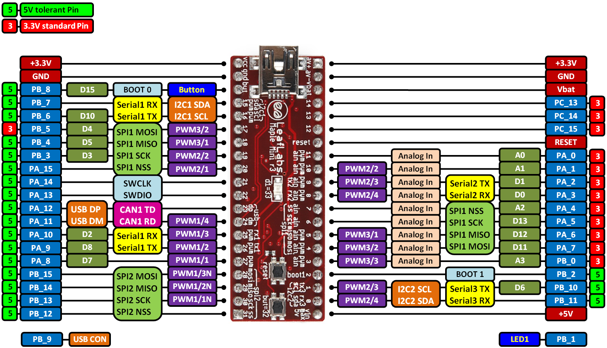

# Maple Mini module board

## Links

- [Maple Mini at STM32duino](http://wiki.stm32duino.com/index.php?title=Maple_Mini)
- [STM32duino bootloader](https://github.com/rogerclarkmelbourne/STM32duino-bootloader)

## Install USB-DFU bootloader

    wget https://github.com/rogerclarkmelbourne/STM32duino-bootloader/raw/master/bootloader_only_binaries/maple_mini_boot20.bin

    openocd -f interface/stlink-v2.cfg -f target/stm32f1x.cfg -c "init ; program maple_mini_boot20.bin 0x8000000; reset ; exit"

    lsusb | grep 1eaf
    #  Bus 002 Device 074: ID 1eaf:0003  

## Firmware uploader

    sudo apt install dfu-util

    # create /etc/udev/rules.d/45-maple.rules : 
    ACTION=="add", SUBSYSTEM=="usb", ATTRS{idVendor}=="1eaf", ATTRS{idProduct}=="0003", TAG+="uaccess"

    sudo udevadm control --reload && sudo udevadm trigger

    dfu-util --list | grep 'alt='
    # Found DFU: [1eaf:0003] ver=0201, devnum=38, cfg=1, intf=0, path="2-1.3", alt=2, name="STM32duino bootloader v1.0  Upload to Flash 0x8002000", serial="LLM 003"
    # Found DFU: [1eaf:0003] ver=0201, devnum=38, cfg=1, intf=0, path="2-1.3", alt=1, name="STM32duino bootloader v1.0  Upload to Flash 0x8005000", serial="LLM 003"
    # Found DFU: [1eaf:0003] ver=0201, devnum=38, cfg=1, intf=0, path="2-1.3", alt=0, name="STM32duino bootloader v1.0  ERROR. Upload to RAM not supported.", serial="LLM 003"

    dfu-util --reset --alt 2 -D binary.bin

## GCC Makefile

See [test/blink/Makefile](test/blink/Makefile)

It includes a [link script](test/blink/ld/stm32f103c8t6-dfu.ld) modified in order to skip the 8K bootloader.

